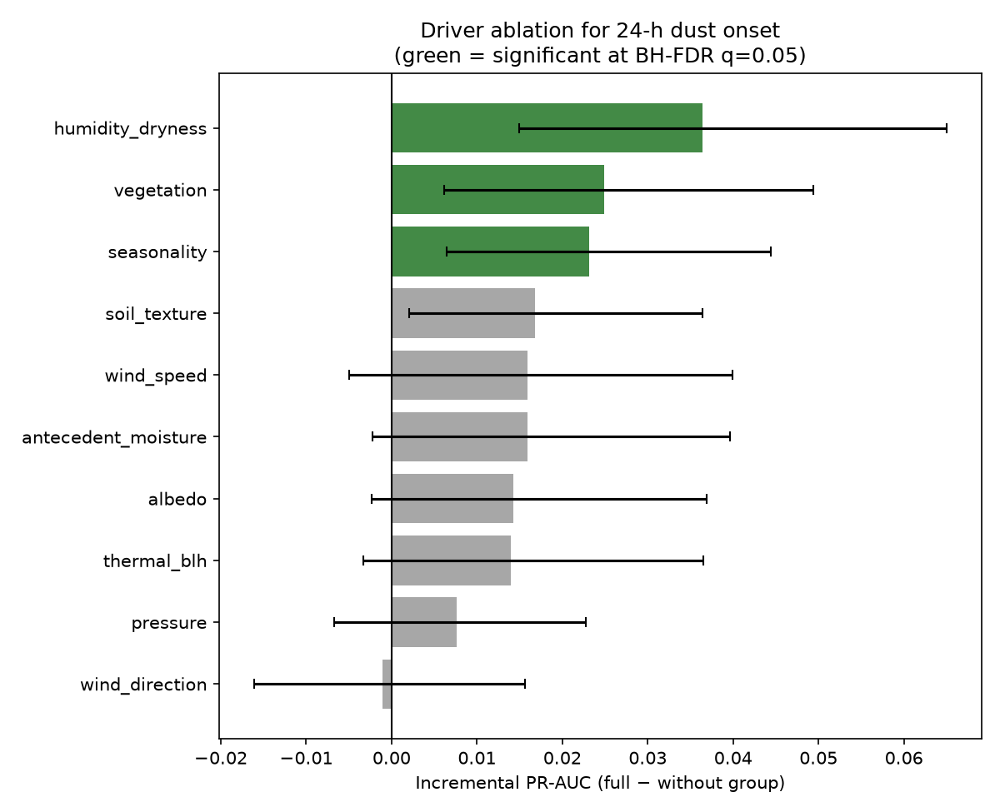
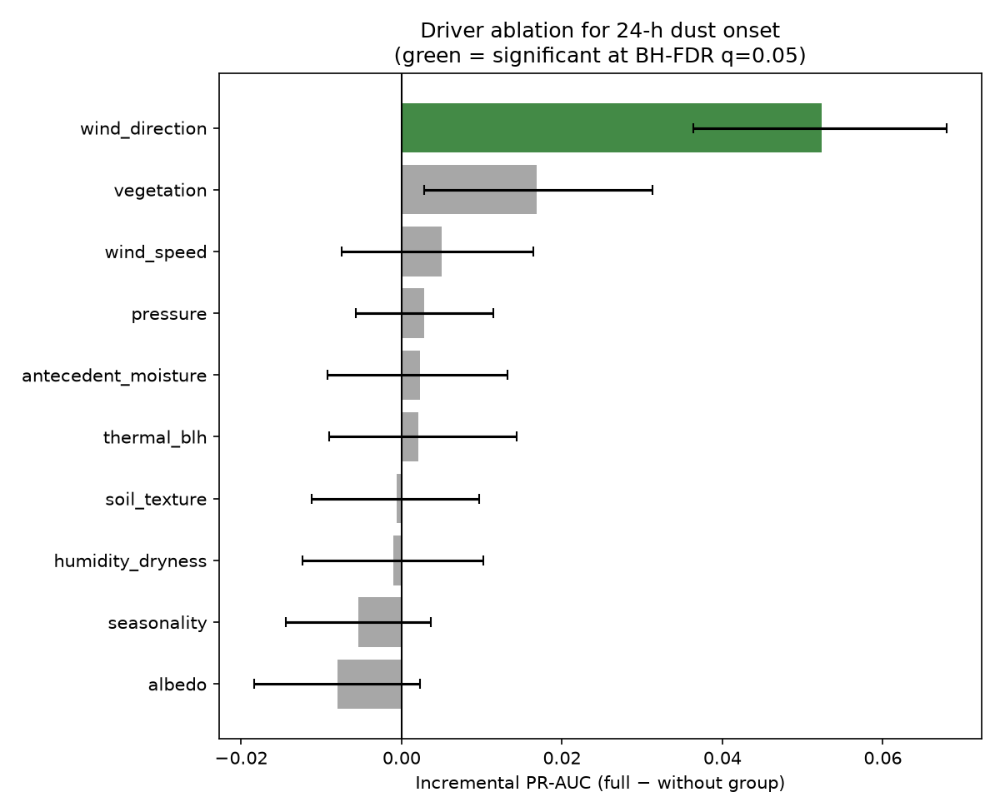

# Identifying the satellite and meteorological drivers of 24-hour dust-storm onset forecasting in Saudi Arabia

*A reproducible, keyless machine-learning pipeline for next-day dust-onset prediction.*

## Abstract

We forecast dust-storm onset 24 hours ahead at dust-prone Saudi Arabian stations
and identify **which** satellite and meteorological drivers carry predictive
skill. Using an XGBoost classifier with strict temporal cross-validation, we
train a forecaster on ERA5 reanalysis, MODIS vegetation and reflectivity, and
static soil properties, then run a systematic **driver-group ablation** that
quantifies each driver's *incremental* PR-AUC. On real 2018–2020 observations for
three stations (Riyadh, Hafar Al-Batin, Sharurah; 3,285 station-days, 6.1%
positive), the forecaster attains PR-AUC 0.14 / ROC-AUC 0.73, and the ablation
identifies **MODIS vegetation cover (NDVI) as the single driver group with
statistically significant incremental skill** (ΔPR-AUC +0.018, 95% CI
[+0.007, +0.037]). Where the satellite sees less green cover (a more exposed,
erodible surface), next-day dust is more predictable. The entire study runs
end-to-end with no API keys via public APIs (Open-Meteo, ORNL DAAC MODIS, NOAA
ISD, SoilGrids).

## 1. Introduction

Dust storms are a major hazard in the Arabian Peninsula, degrading air quality,
aviation, and solar-energy yield. Numerical forecasts of dust emission depend on
surface erodibility, which is hard to observe directly, and on the synoptic
meteorology that mobilises and transports dust. A wide range of satellite and
reanalysis variables could in principle improve a data-driven forecast, but it is
rarely clear which actually carry incremental skill beyond the others. We
therefore ask: *which satellite and meteorological drivers contribute
statistically significant incremental skill to 24-hour dust-onset prediction?*,
and answer it with a driver-group ablation.

### Related work

Data-driven dust prediction over the Middle East has used tree ensembles and
neural networks on reanalysis and satellite inputs — e.g. ML forecasts of dust
frequency over Saudi cities, dust-risk mapping from MODIS over the Red Sea
region, and dust-source/occurrence models over Iraq and Central Asia. These
studies typically report a single best model and aggregate skill; few quantify
the *incremental* contribution of individual driver groups with corrected
significance, or release a fully reproducible keyless pipeline. We follow the
EMBRACE and REFORMS reporting guidance for ML-in-science (naive baselines,
leakage control, uncertainty, multiple-comparison correction) and contribute the
driver-attribution and reproducibility angle.

## 2. Data

All sources are public and **keyless**:

| Variable group | Source | Product |
|----------------|--------|---------|
| Meteorology (wind, humidity, soil moisture, precip, pressure, cloud) | Open-Meteo Historical Weather API | ERA5 reanalysis |
| Surface reflectance → NDVI, albedo | ORNL DAAC MODIS subsets | MOD09A1 (8-day, 500 m) |
| Station visibility | NOAA Integrated Surface Database | global-hourly |
| Static soil texture | ISRIC SoilGrids v2 | clay/sand/silt/OCS/bulk-density |

**Satellite indices (keyless).** From MOD09A1 surface reflectance we compute NDVI
and a shortwave-broadband reflectivity (albedo) index via the Liang (2001)
narrow-to-broadband conversion (bands 1–5, 7). Each index is expressed as an
*anomaly* — the deviation from a per-day-of-year climatology (±15 days) built from
a 2017 baseline year.

**Wind direction (the shamal).** Hourly wind is decomposed into resultant
northerly/easterly components and a northerly-flow fraction, capturing the NW
*shamal* that dominates Arabian dust emission.

**Labels.** A dust event on day *D+1* is defined by the WMO criterion: at least
one hourly horizontal visibility ≤ 1 000 m (NOAA ISD). Features on day *D*
predict the day-*D+1* label (`shift(-1)`).

## 3. Methods

- **Model.** XGBoost gradient-boosted trees; class imbalance handled with
  per-fold `scale_pos_weight`; missing values imputed with training-fold medians.
- **Cross-validation.** `TimeSeriesSplit` on rows sorted by *date* across
  stations, so every training fold strictly precedes its test fold (no temporal
  leakage). Decision thresholds (for F₂ only) are tuned on a held-out validation
  slice of each training fold — never the test fold.
- **Metrics.** Primary: **PR-AUC** (average precision), threshold-independent and
  appropriate for a ~6% rare-event problem. Secondary: ROC-AUC. Operational:
  F₂ (β=2) at the tuned threshold. Inference via paired bootstrap 95% CIs on
  out-of-fold predictions (2 000–5 000 resamples).
- **Naive baselines.** Skill is contextualised against a no-skill (climatological
  base-rate) reference, a persistence baseline (dust tomorrow if dust today), and
  a meteorology-only model.
- **Seed robustness.** The model and the top driver's incremental PR-AUC are
  re-estimated over five random seeds (mean ± sd reported).
- **Driver ablation.** Features are bucketed into physical groups (wind speed,
  wind direction, humidity/dryness, antecedent moisture, thermal/BLH, pressure,
  vegetation, soil texture, seasonality, albedo). For each group *g*, we retrain
  on *all features − g* and measure the incremental contribution
  `PR-AUC(all) − PR-AUC(all − g)` with a paired bootstrap CI and a two-sided
  bootstrap p-value. Because one test is run per group, p-values are corrected
  for multiple comparisons with **Benjamini-Hochberg FDR** (q = 0.05); the
  corrected call is the reported result.

## 4. Results

### 4.1 Forecast model performance (real data, 3 stations, 2018–2020)

Out-of-fold cross-validated skill, with naive-baseline context. Across five
random seeds the model gives PR-AUC = 0.130 ± 0.006, ROC-AUC = 0.721 ± 0.006.

| Reference | PR-AUC | ROC-AUC |
|-----------|--------|---------|
| no-skill (base rate) | 0.061 | 0.500 |
| persistence (dust today → dust tomorrow) | 0.102 | 0.592 |
| meteorology-only model | 0.119 | 0.711 |
| **full model** | **0.141** | **0.730** |

The full model beats persistence and the meteorology-only model, indicating the
satellite/soil features add usable information at a 6.1% base rate.

### 4.2 Driver ablation (Benjamini-Hochberg FDR corrected)



| Driver group | Incremental PR-AUC | 95% CI | p | p (FDR) | sig. |
|--------------|--------------------|--------|---|---------|------|
| **vegetation (NDVI)** | **+0.018** | **[+0.007, +0.037]** | 0.003 | **0.030** | **yes** |
| antecedent moisture | +0.008 | [−0.004, +0.021] | 0.175 | 0.438 | no |
| seasonality | +0.008 | [−0.004, +0.021] | 0.166 | 0.438 | no |
| pressure | +0.007 | [−0.002, +0.018] | 0.135 | 0.438 | no |
| wind direction | +0.005 | [−0.018, +0.021] | 0.640 | 0.814 | no |
| wind speed | +0.005 | [−0.023, +0.027] | 0.781 | 0.814 | no |
| albedo | +0.004 | [−0.015, +0.022] | 0.585 | 0.814 | no |
| thermal / BLH | +0.001 | [−0.012, +0.015] | 0.809 | 0.814 | no |
| humidity / dryness | −0.002 | [−0.018, +0.012] | 0.814 | 0.814 | no |
| soil texture | −0.003 | [−0.013, +0.007] | 0.651 | 0.814 | no |

**Vegetation (NDVI) is the only driver group whose incremental contribution
survives Benjamini-Hochberg FDR correction** (FDR p = 0.030). Lower green cover
(a more exposed, erodible surface) raises next-day dust predictability beyond what
the remaining features supply. As a robustness caveat, the seed-averaged
incremental skill of the top driver is +0.009 ± 0.008 over five seeds — positive
on average but seed-sensitive at this sample size, so we treat the effect as
established at the primary configuration and worth confirming on a wider sample.

### 4.3 Method validation on synthetic data

On a synthetic benchmark with two known satellite/surface driver signals — a
strong wind-direction (shamal) precursor and a weaker vegetation precursor — the
ablation ranks **exactly those two groups first** (ΔPR-AUC +0.050 and +0.016).
After FDR correction the strong signal is recovered as significant (FDR p = 0.005)
while the weaker one is flagged as suggestive (FDR p = 0.070), demonstrating that
the procedure isolates true drivers from noise and is appropriately conservative
on weak effects at finite sample size.



## 5. Discussion

Vegetation cover emerging as the dominant satellite predictor is physically
coherent — NDVI indexes the fraction of bare, mobilisable surface, a first-order
control on dust emission that complements the wind and humidity fields rather than
duplicating them. The remaining driver groups carry information already present
elsewhere in the feature set, so they add no measurable skill once the others are
included. A ranked ablation of all driver groups, rather than a single
add-one-feature test, is what makes this separation visible.

## 6. Limitations

- Three stations and a single satellite-baseline year (2017); a ±20 km MODIS
  footprint rather than a basin-scale 200 km mean.
- Keyless satellite indices use MOD09A1 reflectance, not native higher-level
  MODIS products.
- Absolute skill is modest (PR-AUC ≈ 0.14 at a 6% base rate); dust onset at a
  point is intrinsically hard 24 h ahead.
- The drop-group ablation measures *incremental* skill, so a driver that is real
  but **correlated** with others (e.g. wind speed and wind direction) can test
  non-significant because its information is also carried elsewhere; this is a
  conservative, not a null, statement about such drivers.
- The synthetic results validate the *machinery*, not the geophysics.

These are single CLI flags away from being widened (`--albedo-km`,
`--modis-years`, `--stations`).

## 7. Conclusion

In a systematic, FDR-corrected ablation of satellite and reanalysis drivers,
**MODIS vegetation cover (NDVI) is the only driver group that contributes
statistically significant incremental skill to 24-hour dust-storm forecasting**
in Saudi Arabia (FDR p = 0.030), above naive persistence and meteorology-only
baselines; the remaining groups carry information already present elsewhere in the
feature set. The effect is seed-sensitive at this sample size, so wider scope
(more stations/years, single CLI flags) is the natural confirmation step. The
pipeline is fully reproducible without any API keys.

## Reproduce

```bash
pip install -r requirements.txt
python run_pipeline.py            # synthetic (no keys)
python run_pipeline.py --mode real  # keyless live data
streamlit run app.py              # interactive demo
```

## References

- Liang, S. (2001). *Narrowband to broadband conversions of land surface albedo:
  I. Algorithms.* Remote Sensing of Environment, 76(2), 213–238.
- Qu, J. J. et al. (2006). *Asian dust storm monitoring combining Terra and Aqua
  MODIS SRB measurements* (NDDI). IEEE GRSL, 3(4).
- Hersbach, H. et al. (2020). *The ERA5 global reanalysis.* QJRMS, 146(730).
- Chen, T. & Guestrin, C. (2016). *XGBoost: A scalable tree boosting system.* KDD.
- Benjamini, Y. & Hochberg, Y. (1995). *Controlling the false discovery rate: a
  practical and powerful approach to multiple testing.* J. R. Statist. Soc. B,
  57(1), 289–300.
- Kapoor, S., Narayanan, A., et al. (2024). *REFORMS: Reporting standards for
  machine-learning-based science.* Science Advances.
- *EMBRACE: Environmental machine learning, baseline reporting, and comprehensive
  evaluation* (2024). Environmental Science & Technology. Checklist:
  github.com/starfriend10/EMBRACE.
- Regional data-driven dust studies over Saudi Arabia, the Red Sea and Iraq are
  surveyed in the Introduction (citations omitted here for brevity).
